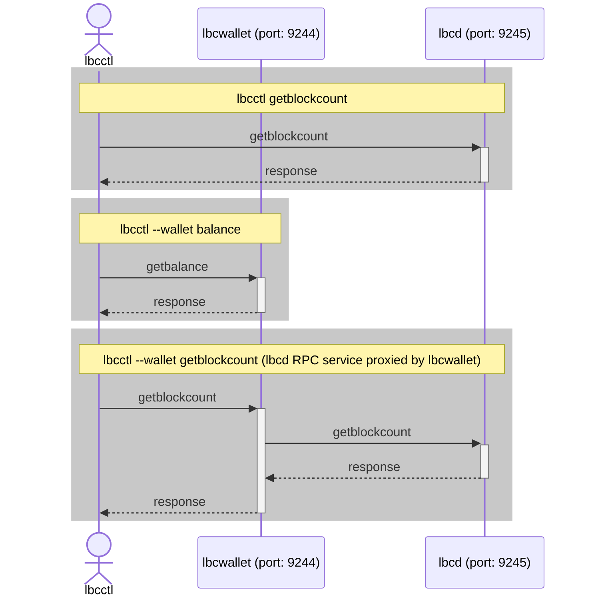
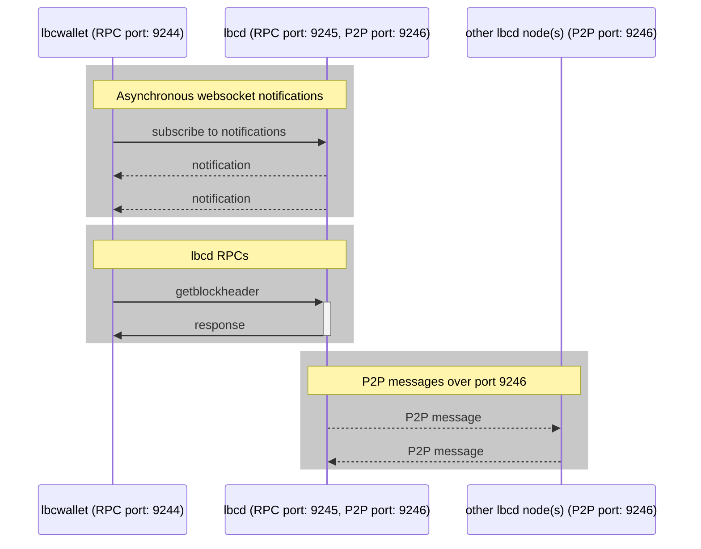

# lbcd

[](https://github.com/lbryio/lbcd/actions)
[](https://coveralls.io/github/lbryio/lbcd?branch=master)
[](http://copyfree.org)
<!--[](https://pkg.go.dev/github.com/lbryio/lbcd)-->

**lbcd** is a full node implementation of LBRY's blockchain written in Go (golang).

Software stack developed by LBRY teams has been all migrated to **lbcd**.

We're working with exchanges and pool oerators to migrate from **lbrycrd** to **lbcd**.

If you're integrating with **lbcd+lbcwallet**, please check the Wiki for current [supported RPCs](wiki/RPC-availability).

Note: **lbcd** does *NOT* include wallet functionality.  That functionality is provided by the
[lbcwallet](https://github.com/lbryio/lbcwallet) and the [LBRY SDK](https://github.com/lbryio/lbry-sdk).

## Requirements

All common operating systems are supported. lbcd requires at least 8GB of RAM
and at least 100GB of disk storage. Both RAM and disk requirements increase slowly over time.
Using a fast NVMe disk is recommended.

## Installation

Acquire binary files from [releases](https://github.com/lbryio/lbcd/releases)

For compilation, [Go](http://golang.org) 1.18 or newer is required.
Install Go according to its [installation instructions](http://golang.org/doc/install).

``` sh
# lbcd (full node)
$ go install github.com/lbryio/lbcd@latest

# lbcctl (rpc client utility)
$ go install github.com/lbryio/lbcd/cmd/lbcctl@latest
```

## Usage

Default application folder `${LBCDDIR}`:

- Linux: `~/.lbcd/`
- MacOS: `/Users/<username>/Library/Application Support/Lbcd/`

### Start the **lbcd**

``` sh
./lbcd
```

**lbcd** loads config file at `"${LBCDDIR}/lbcd.conf"`.

If no config is found, it creates a [default one](sample-lbcd.conf), which includes all available options with default settings except randomly generated *RPC credentials* (see below).

### RPC server

RPC credentials (`rpcuser` and `rpcpass`) is required to enable RPC server. It can be specify in the `"${LBCDIR}/lbcd.conf"`, using command line options:

``` sh
./lbcd --rpcuser=rpcuser --rpcpass=rpcpass

2022-07-28 12:28:19.627 [INF] RPCS: RPC server listening on 0.0.0.0:9245
2022-07-28 12:28:19.627 [INF] RPCS: RPC server listening on [::]:9245
```

### Working with TLS (Default)

By default, **lbcd** runs RPC server with TLS enabled, and generates the `rpc.cert` and `rpc.key` under `${LBCDDIR}`, if not exist already.

To interact with the RPC server, a client has to either specify the `rpc.cert`, or disable the certification verification for TLS.

Interact with **lbcd** RPC using `lbcctl`

``` sh
$ ./lbcctl --rpccert "${LBCDDIR}/rpc.cert" getblockcount

# or disable the certificate verification
$ ./lbcctl --skipverify getblockcount

1200062
```

Interact with **lbcd** RPC using `curl`

``` sh
$ curl --user rpcuser:rpcpass \
        --cacert "${LBCDDIR}/rpc.cert" \
        --data-binary '{"jsonrpc": "1.0", "id": "curltest", "method": "getblockcount", "params": []}' \
        -H 'content-type: text/plain;' \
        https://127.0.0.1:9245/

# or disable the certificate verification
$ curl --user rpcuser:rpcpass \
        --insecure \
        --data-binary '{"jsonrpc": "1.0", "id": "curltest", "method": "getblockcount", "params": []}' \
        -H 'content-type: text/plain;' \
        https://127.0.0.1:9245/
```

``` json
{"jsonrpc":"1.0","result":1200062,"error":null,"id":"curltest"}
```

### Working without TLS

TLS can be disabled using the `--notls` option:

``` sh
$ ./lbcd --notls
```

``` sh
$ ./lbcctl --notls getblockcount

1200062
```

``` sh
$ curl --user rpcuser:rpcpass \
        --data-binary '{"jsonrpc": "1.0", "id": "curltest", "method": "getblockcount", "params": []}' \
        -H 'content-type: text/plain;' \
        http://127.0.0.1:9245/
```

``` json
{"jsonrpc":"1.0","result":1200062,"error":null,"id":"curltest"}
```

## Using Snapshots (optional)

[Snapshots](https://snapshots.lbry.com/blockchain/) are created bi-weekly to help new users catch up current block height.

The snapshots are archived and compressed in [zstd](https://facebook.github.io/zstd/) format for it's compression ratio and speed.

Download the snapshot, and uncompress it:

``` sh
time curl -O https://snapshots.lbry.com/blockchain/lbcd_snapshot_1199527_v0.22.105_2022-07-27.tar.zst
zstd -d lbcd_snapshot_1199527_v0.22.105_2022-07-27.tar.zst | tar xf - -C "${LBCDIR}"
```

If preferred, a user can download and uncompress the snapshot on the fly:
By the time the download is finished, the snapshots should be almost uncompressed already.

``` sh
mkdir -p "${LBCDDIR}"

time curl https://snapshots.lbry.com/blockchain/lbcd_snapshot_1199527_v0.22.105_2022-07-27.tar.zst | zstd -d | tar xf - -C "${LBCDIR}"

#  % Total    % Received % Xferd  Average Speed   Time    Time     Time  Current
#                                 Dload  Upload   Total   Spent    Left  Speed
# 100 64.9G  100 64.9G    0     0  37.0M      0  0:29:49  0:29:49 --:--:-- 33.0M
#
# real    29m49.962s
# user    6m53.710s
# sys     8m56.545s
```

## Working with RPCs

Using `lbcctl -l` to list available RPCs:

``` sh
$ lbcctl -l

Chain Server Commands:
addnode "addr" "add|remove|onetry"
createrawtransaction [{"txid":"value","vout":n},...] {"address":amount,...} (locktime)
debuglevel "levelspec"
decoderawtransaction "hextx"
decodescript "hexscript"
deriveaddresses "descriptor" ({"value":value})
fundrawtransaction "hextx" {"changeaddress":changeaddress,"changeposition":changeposition,"changetype":changetype,"includewatching":includewatching,"lockunspents":lockunspents,"feerate":feerate,"subtractfeefromoutputs":[subtractfeefromoutput,...],"replaceable":replaceable,"conftarget":conftarget,"estimatemode":estimatemode} (iswitness)
generate numblocks

[skipped]

Wallet Server Commands (--wallet):
addmultisigaddress nrequired ["key",...] ("account")
addwitnessaddress "address"
backupwallet "destination"
createmultisig nrequired ["key",...]
createnewaccount "account"
createwallet "walletname" (disableprivatekeys=false blank=false passphrase="" avoidreuse=false)
dumpprivkey "address"
dumpwallet "filename"
encryptwallet "passphrase"
estimatefee numblocks
estimatepriority numblocks
estimatesmartfee conftarget (estimatemode="CONSERVATIVE")
getaccount "address"
getaccountaddress "account"
getaddressesbyaccount "account"

[skipped]
```

Using `lbcctl help rpcname` to show the RPC spec:

``` sh
$ lbcctl help getblock

getblock "hash" (verbosity=1)

Returns information about a block given its hash.

Arguments:
1. hash      (string, required)             The hash of the block
2. verbosity (numeric, optional, default=1) Specifies whether the block data should be returned as a hex-encoded string (0), as parsed data with a slice of TXIDs (1), or as parsed data with parsed transaction data (2)

Result (verbosity=0):
"value" (string) Hex-encoded bytes of the serialized block

Result (verbosity=1):
{
 "getblockverboseresultbase": { (object)
  "hash": "value",              (string)          The hash of the block (same as provided)
  "confirmations": n,           (numeric)         The number of confirmations
  "strippedsize": n,            (numeric)         The size of the block without witness data
  "size": n,                    (numeric)         The size of the block
  "weight": n,                  (numeric)         The weight of the block
  "height": n,                  (numeric)         The height of the block in the block chain
  "version": n,                 (numeric)         The block version
  "versionHex": "value",        (string)          The block version in hexadecimal
  "merkleroot": "value",        (string)          Root hash of the merkle tree
  "time": n,                    (numeric)         The block time in seconds since 1 Jan 1970 GMT
  "mediantime": n,              (numeric)         The median block time in seconds since 1 Jan 1970 GMT
  "nonce": n,                   (numeric)         The block nonce
  "bits": "value",              (string)          The bits which represent the block difficulty
  "difficulty": n.nnn,          (numeric)         The proof-of-work difficulty as a multiple of the minimum difficulty
  "chainwork": "value",         (string)          Expected number of hashes required to produce the chain up to this block (in hex)
  "previousblockhash": "value", (string)          The hash of the previous block
  "nextblockhash": "value",     (string)          The hash of the next block (only if there is one)
  "nameclaimroot": "value",     (string)          Root hash of the claim trie
  "nTx": n,                     (numeric)         The number of transactions (aka, count of TX)
 },
 "tx": ["value",...],           (array of string) The transaction hashes (only when verbosity=1)
}
```

## **lbcd** & **lbcwallet**

*Wallet* related functianlities and RPCs are provided by a separate programe - [**lbcwallet**](https://github.com/lbryio/lbcwallet).

Once setup, lbcwallet can serve wallet related RPCs as well as proxy lbcd RPCs to an assocated lbcd now.
It's sufficient for user to connect just the **lbcwallet** instead of both.



While **lbcd** can run standalone as a full node, **lbcwallet** requires an associated **lbcd** instance for scanning and sync'ing block data.



## Data integrity

**lbcd** is not immune to data loss. It expects a clean shutdown via SIGINT or
SIGTERM. SIGKILL, immediate VM kills, and sudden power loss can cause data
corruption, thus requiring chain resynchronization for recovery.

## Security

We take security seriously. Please contact [security](mailto:security@lbry.com) regarding any security issues.
Our PGP key is [here](https://lbry.com/faq/pgp-key) if you need it.

We maintain a mailing list for notifications of upgrades, security issues,
and soft/hard forks. To join, visit [fork list](https://lbry.com/forklist)

## Contributing

Contributions to this project are welcome, encouraged, and compensated.
The [integrated github issue tracker](https://github.com/lbryio/lbcd/issues)
is used for this project. All pull requests will be considered.

<!-- ## Release Verification
Please see our [documentation on the current build/verification
process](https://github.com/lbryio/lbcd/tree/master/release) for all our
releases for information on how to verify the integrity of published releases
using our reproducible build system.
-->

## License

lbcd is licensed under the [copyfree](http://copyfree.org) ISC License.
