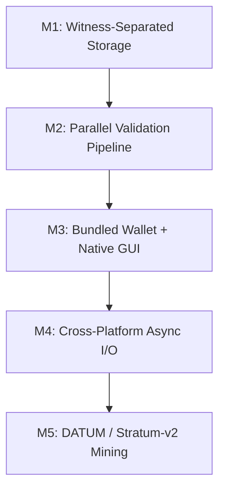
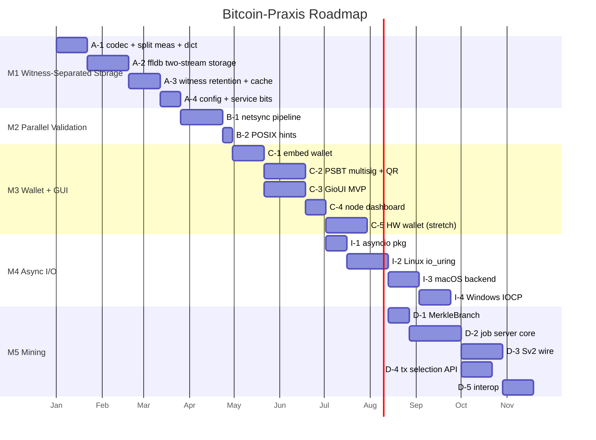

# Bitcoin-Praxis Roadmap: A Credible, Full-Chain Alternative to Bitcoin Core

## Thesis

Bitcoin-Praxis is a production-grade Bitcoin full node forked from btcd (Go).
btcd has a long track record of stability, consensus test vectors, and already
powers a majority share of the Lightning Network via LND. Upstream btcd is not,
however, a credible alternative to Bitcoin Core for most end users — it ships no
wallet, no GUI, stores blocks uncompressed, and offers no mining job negotiation.

This roadmap turns that foundation into Bitcoin-Praxis: a single self-contained
`praxisd` binary that a non-mining user can run in place of Bitcoin Core, with
materially lower disk and SSD-wear cost, faster initial block download, a bundled
wallet and native (non-web) **Bitcoin-Praxis Wallet** GUI, and — as a final
milestone — a decentralized mining job server.

The ordering is deliberate: compression is the critical technical risk and goes
first; parallel validation pairs with it as the speed headline; wallet and GUI
deliver the user-facing surface that makes the node a real Core replacement;
cross-platform async I/O extends the I/O work to other operating systems; mining
is the deepest and most volatile workstream and goes last.

## Guiding Principles

1. **Consensus safety is never compromised.** Every milestone runs the existing
   `blockchain/fullblocktests` suite and produces identical consensus outcomes to
   the unmodified codebase. Storage, I/O, and mining work live below or beside
   the consensus layer — never inside it.
2. **Full base ledger, always.** Block pruning (deleting whole blocks) is
   unacceptable to Lightning routing nodes and to users who need to resolve
   arbitrary historical transaction data. Every milestone preserves the complete
   base transaction ledger. The disk-space win comes from witness separation
   (structural data compresses; high-entropy signatures are either stored
   separately or dropped beyond a rolling reorg-safe buffer) — never from
   deleting the transaction history itself. A full-archival mode that retains
   witness forever is always available.
3. **Pure Go, no web, no CGo by default.** The Go language is the on-ramp for new
   contributors who want to avoid Core's language and in-group gatekeeping. The
   GUI is non-web (GioUI). CGo is only an optional stretch for hardware-wallet
   device transport.
4. **Linux-first where OS-specific features apply.** io_uring lands on Linux
   first; macOS and Windows I/O work follows.

---

## Milestone Ordering

| # | Milestone | Headline Claim |
|---|---|---|
| M1 | Witness-Separated Storage | **52.5% smaller** (measured on 1005 GB mainnet chain → ~477 GB), Lightning-compatible |
| M2 | Parallel Validation Pipeline | 2–3× faster IBD via cross-platform parallel script validation |
| M3 | Bundled Wallet + Native GUI | Full Core-QT replacement for non-mining users |
| M4 | Cross-Platform Async I/O | io_uring on Linux; macOS/Windows I/O backends |
| M5 | DATUM / Stratum-v2 Mining | First major node with decentralized pool job negotiation |

---

## M1 — Witness-Separated Storage

**Why first:** the single most repeated grievance against running a full node is
disk space and, secondarily, SSD wear from chain bloat. Block pruning does not
solve this for Lightning nodes or users who want a self-sovereign full archive.
This milestone is the critical technical risk and goes first.

The original plan was whole-block zstd compression. Measurement on real
mainnet blocks disproved the ~50% target for that approach: whole-block zstd
yields only ~24% because modern blocks are dominated by high-entropy witness
(signatures), which are near-incompressible (~20% reduction) even at max zstd
level. Witness data is the majority of modern-block bytes and the reason
whole-block compression stalls.

The fix is to **stop storing witness data long-term**. The wire layer
already has the split primitive (`SerializeNoWitness` /
`DeserializeNoWitness` / `SerializeSizeStripped` in `wire/msgblock.go`).
Witness is required for initial validation and for serving full blocks to
modern peers, but **not** for the UTXO set, new-block validation, Lightning
historical monitoring, or Neutrino serving. The high-entropy witness bytes
that don't compress are simply discarded once a block is old enough that no
realistic reorg or protocol needs them. The structural non-witness bytes that
*do* compress (~30%) are what gets kept, compressed, forever.

**Headline claim (measured on real mainnet chain):** **52.5% blended disk reduction**
across the full chain — drop witness older than a 2016-block rolling buffer,
zstd-compress the stripped block. On a 1005 GB chain this saves ~528 GB,
bringing the footprint to ~477 GB.

Measured by streaming 156,013 blocks from 29 evenly-spaced .fdb files across a
full synced mainnet datadir (1406 files, blocks/mainnet/blocks_ffldb):

| Approach | Reduction | Est. full-chain size |
|---|---|---|
| Compress whole block (zstd only) | 23.9% | 765 GB |
| Excise witness only (no zstd) | 35.8% | 645 GB |
| **Excise witness + zstd stripped** | **52.5%** | **477 GB** |

The witness fraction grows over time: 0% pre-segwit, 2–23% by 2018–19,
24–46% by 2020–22, 48–70% recently (2024–25). Since modern blocks dominate disk
bytes, the blended reduction tracks the high-witness tail. Modern-era files
alone achieve 65–80% reduction.

A small pilot trained a zstd dictionary on ~200 real mainnet blocks (16KB
samples each) and compared it to plain zstd. The dictionary added only 0.0–0.4
percentage points — not a large enough sample to prove dictionaries never help,
but enough that FormatV1 does not bake one in: cold blocks are compressed with
plain zstd. A trained dictionary can ship as a future format version if a larger
study finds real gain.

Earlier two-fixture measurement (post-segwit, 26% and 74% witness):

| Approach | Fixture 0 (26% witness) | Fixture 1 (74% witness) | Blended |
|---|---|---|---|
| Compress whole block (zstd) | 25.0% | 23.6% | 24.1% |
| Excise witness only | 26.4% | 74.4% | 57.4% |
| **Excise witness + zstd stripped** | **48.3%** | **82.0%** | **70.0%** |

### Scope

The storage is split into two tiers by age:

- **Hot tier (recent blocks, last 2016 ≈ 2 weeks): stored exactly as praxisd does
  today (same hot path as upstream btcd).** Full block, with witness, uncompressed.
  Near-tip acceptance still appends the raw block via `writeBlock`. During IBD,
  when the **headers tip** already places a height past the witness buffer, the
  body is written **cold-direct** (`StoreBlockCold`: strip+zstd in memory, one
  NAND write) instead of hot-then-age-out. Tip-window blocks stay hot so
  `FetchBlock` returns a full witness-included block for everything live.
  Storage cost of not compressing the hot window: 2016 blocks × ~2 MB ≈ 4 GB, vs
  ~1.2 GB if compressed — a ~2.8 GB difference on a ~755 GB chain (0.4%).
- **Cold tier (blocks older than 2016): witness stripped, non-witness
  zstd-compressed, retained forever.** Populated either by cold-direct IBD
  writes or by rolling age-out: read hot → `SerializeNoWitness` → compress →
  write cold → reclaim hot space. The cold tier holds the vast majority of the
  chain. Alternate forks (side chains) that never become tip are not compacted:
  once they fall past the witness buffer their **block bodies are dropped**
  (headers retained in the block index) — they are dead for realistic reorgs,
  and deep cold attach is already refused.

Because recent blocks are stored whole and old blocks have no witness at all,
there is never a case where a stripped block needs witness re-attached. The
witness re-attachment problem does not exist in this design.

- New `blockcompress/` package: deterministic zstd codec
  (`klauspost/compress/zstd`, pure Go) for the cold-tier non-witness stream.
  FormatV1 uses plain zstd with no trained dictionary — a ~200-block pilot
  gained <0.4 percentage points, not enough to justify forever-pinning dict
  bytes in the format. A dictionary can ship as a future format version if a
  larger study finds real gain.
- **Per-file format header** on cold block files: magic + format-version byte
  selecting the dictionary/encoder config. Hot files (and existing legacy
  datadirs) have no header and read uncompressed — mixed-format datadirs are
  supported with no migration step. A block's `blockLocation` names the file, and
  the file's header tells the reader how to decode it.
- **Integrity preserved.** The cold record format stays
  `<network:4><origLen:4><compressedStrippedBlock><crc:4>` — same 12-byte
  overhead as today, where `origLen` is the *uncompressed* stripped-block length
  and the compressed length is derivable as `loc.blockLen - 12`. The CRC covers
  the **original uncompressed** stripped bytes
  (`crc32(network || origLen || strippedBlock)`), exactly as `writeBlock` does
  today, so a codec bug that decompresses to wrong bytes is caught the same way
  storage corruption is caught today. zstd's frame checksum additionally
  validates the compressed stream. `blockLocation.blockLen` continues to mean
  "on-disk record bytes"; no block-index migration.
- **Index-before-excision.** `txindex`/`addrindex` populate from the in-memory
  block (witness present) at validation time, *before* the block reaches the cold
  tier. Indexes are keyed on `txid` (not `wtxid`), so they remain valid and
  complete — including Taproot script-path spends, whose spending conditions are
  parsed from the witness at validation time and indexed then. Index size is
  unaffected by cold-tier compaction; only the raw block files shrink.
- `readBlockRegion` (`blockio.go`) for cold files decompresses the stripped
  block then slices, with a bounded LRU decompressed-block cache on `blockStore`
  to avoid re-decompression across indexer region reads. For hot files it reads
  raw as today.
- **Service-bit handling.** The node advertises `NODE_NETWORK` for the full base
  ledger history and `NODE_WITNESS` for the hot window (recent blocks retain
  full witness). `MSG_WITNESS_BLOCK` requests for cold heights return `notfound`;
  peers fetch `MSG_BLOCK` (stripped) instead.
- Config flags: `--witness-buffer=N` (default `2016`; the number of recent blocks
  kept full and uncompressed before age-out to the cold tier). A future
  `--no-witness-excision` flag to keep the hot tier forever (full archival) is
  deferred — the default design is the excised-witness one.
- Dictionary training tool (`//go:build ignore` program) that samples real
  mainnet blocks and trains a zstd dictionary for the stripped-block stream.

### Determinism invariants (non-negotiable)

These hold the property Core's uncompressed storage gives for free — that every
node reconstructs the same logical block bytes — and are the answer to the
standard objection that compression endangers deterministic results:

1. **Lossless, pure-function decode.** zstd decompression is a pure function of
   `(compressed stream, dictionary)`. Given the same bytes and dictionary, every
   node produces identical output, always, across library versions. The existing
   `blockchain/fullblocktests` suite and the round-trip acceptance criterion
   verify this end-to-end.
2. **Dictionary pinned per file, not per node.** The format-version byte in each
   file's header selects the dictionary for every record in that file. A block
   compressed with dictionary v1 is *always* decoded with dictionary v1, never
   "the current one." All historical dictionaries are bundled in the binary (one
   per format version, via `//go:embed`) so a node can always read any file it
   encounters. A dictionary mismatch fails the zstd frame check rather than
   silently yielding wrong bytes.
3. **Encoder config pinned per format version.** The zstd encoder level and
   dictionary bytes are fixed by the format-version byte, so all nodes on the
   same praxisd version produce identical compressed files. A future format bump
   changes on-disk bytes but old files still decode with their pinned
   dictionary. (Note: on-disk byte-identity across nodes is not a property
   Bitcoin Core guarantees today — pruning and arrival order already vary
   `blk*.dat` between nodes. The guarantee that matters, identical logical
   blocks, is preserved.)
4. **Strip serialization is deterministic.** `SerializeNoWitness` is a fixed
   wire encoding: every node produces identical non-witness bytes for the same
   logical block. The non-witness stream is therefore byte-stable across nodes,
   independent of the compressor.
5. **Witness retention is deterministic per height.** Whether a block is in the
   hot tier (full, with witness) or the cold tier (stripped, compressed) is a
   pure function of its height relative to the current tip and the buffer size —
   not of node identity or timing. Two nodes at the same tip retain exactly the
   same hot window.
6. **Consensus code never sees compressed bytes.** Compression lives entirely
   below the `database.DB` interface; every consensus check, merkle/PoW
   validation, witness commitment check, and test vector operates on the
   decompressed block. A codec bug that altered bytes would fail the
   original-block CRC *and* consensus validation, the same two layers that guard
   the uncompressed path today.
7. **Near-tip writes stay uncompressed.** Block acceptance into the hot window
   writes the full raw block exactly as upstream; compression is not on the
   live tip critical path. During IBD, heights already past the buffer relative
   to the headers tip use `StoreBlockCold` (strip+zstd once) so catch-up does
   not double-write hot then cold.

### Why the target is realistic (measured, not estimated)

The headline is grounded in measurement on a real synced mainnet datadir (1005 GB,
1406 .fdb files, ~880K blocks), not an estimate. 29 evenly-spaced files were
streamed (one block at a time, no full-file reads), covering the full chain from
block 0 to the current tip:

| Approach | Reduction | Est. full-chain size |
|---|---|---|
| Compress whole block (zstd only) | 23.9% | 765 GB |
| Excise witness only (no zstd) | 35.8% | 645 GB |
| **Excise witness + zstd stripped** | **52.5%** | **477 GB** |

Two structural facts make this hold chain-wide:

1. **The stripped block is structural and compresses ~25–30%.**
   P2PKH/P2WPKH/P2SH scripts share identical wrappers around 20-byte hashes;
   amounts cluster; varints and lengths are small and repetitive; outpoint txids
   repeat within and across blocks. Removing the high-entropy witness from the
   compressed stream is what lifts the ratio from ~24% (whole-block) to ~25–30%
   on the stripped bytes alone. A small ~200-block dictionary pilot gained only
   0.0–0.4 percentage points over plain zstd — not definitive, but enough that
   FormatV1 uses plain zstd (no trained dictionary). A future format version can
   add one if a larger study finds real gain.
2. **The witness is high-entropy and dominates modern blocks.**
   Signatures and public keys are near-incompressible (~20% even at max zstd
   level), so whole-block compression stalls at ~24%. But the same fact makes
   *dropping* the witness recover the bytes that don't compress — and since
   compressing the witness is futile, it is not stored compressed; it is simply
   not kept past the hot window. The chain-wide witness fraction grows over
   time: 0% pre-segwit (blocks <481824), 2–23% by 2018–19, 24–46% by 2020–22,
   48–70% recently (2024–25). Disk bytes are dominated by the modern high-witness
   tail, so the blended chain-wide reduction tracks the modern-tail numbers, not
   the early P2PKH era.

The codebase already contains domain-specific compression precedent in
`blockchain/chainio.go` (varint amounts, compressed script types for the UTXO
set) — this milestone reuses that philosophy on the block-file path.

**Accepted losses** (documented, not hidden — these are the cost of the ~70%
headline, all confined to blocks older than the 2016 hot window):
- Cannot serve `MSG_WITNESS_BLOCK` for cold heights to modern peers (answered
  with `notfound`; peers use `MSG_BLOCK` for the stripped base ledger). The node
  still advertises `NODE_WITNESS` so hot-window witness blocks are served.
- Ordinals/inscription data (stored in witness) is not retained past the hot
  window — arguably a feature for the anti-bloat audience, and the node still
  validates it at acceptance time.
- A full `reindex` from scratch requires re-downloading witness for the cold
  range (same tradeoff as block pruning today).
- `getrawtransaction` / verbose `getblock` on a cold-height tx or block set
  `witness_excised: true`; size/vsize/weight describe the stripped serialization
  only, and `hash` equals `txid` (historical wtxid is unavailable). Bundled
  btcwallet must honor this flag — see M3 “btcwallet changes required for M1
  witness excision.”
- `invalidateblock` deeper than the witness buffer, and `reconsiderblock` of a
  cold block, are refused with a clear `ErrWitnessExcised` error (full archival
  requires `--witness-buffer=0`). Natural reorgs within/around the hot window
  continue to work via `KnownValid`.

### Acceptance Criteria

1. **Ratio**: the cold tier achieves **≥ 50% blended reduction** vs storing the
   same blocks full and uncompressed. Measured across 156K blocks from 29
   evenly-spaced files spanning the full mainnet chain. **Measured: 52.5%.**
2. **Round-trip integrity**: the cold-tier stripped stream decompresses
   byte-identical to `SerializeNoWitness` output; CRC checks fire on corruption;
   `blockchain/fullblocktests` passes with the two-tier storage enabled and
   produces consensus results identical to the uncompressed baseline.
3. **Reorg safety**: the node validates correctly through a simulated reorg up to
   2016 blocks deep (the hot window). Deeper operator invalidate/reconsider of
   cold blocks is refused with `ErrWitnessExcised`; natural reorgs rely on
   `KnownValid` and do not re-download cold witness.
4. **Index completeness**: `txindex`/`addrindex` return complete results for
   `txid`-keyed queries including Taproot script-path spends, because indexing
   happens before age-out. A query for a cold-height tx sets `witness_excised`
   rather than inventing a false wtxid or silent empty witness.
5. **Hot-path neutral**: write throughput and `readBlock` latency for hot-tier
   blocks are within 10% of uncompressed (they *are* uncompressed — this verifies
   the hot path is genuinely untouched).
6. **SSD-wear**: during headers-ahead IBD, cold-direct writes (`StoreBlockCold`)
   program roughly the cold footprint once instead of hot+cold. Bytes written
   on a full-chain catch-up should drop by ≥ 40% vs uncompressed hot-only
   archival, dominated by the cold majority.
7. **Race-clean**: `go test -race` passes across `blockcompress` and `ffldb`.

### Phasing

| Phase | Scope |
|---|---|
| A-1 | `blockcompress` codec + witness-split measurement + dictionary training + unit tests. No ffldb changes. **This phase alone produces the go/no-go ratio number.** (Status: **done.** Codec, tests, witness-split measurement, and dictionary training all complete and race-clean. Real-chain measurement: 52.5% blended reduction. A ~200-block dictionary pilot gained <0.4pp; FormatV1 uses plain zstd, with room for a future format version if a larger study finds real gain.) |
| A-2 | Cold-tier file format: per-file header, `writeBlock`/`readBlock` paths that handle both headerless-uncompressed (hot/legacy) and compressed-stripped (cold) files via the header check, `readBlockRegion` decompress for cold files. Whitebox unit tests. No age-out job yet — blocks are written cold directly in tests. |
| A-3 | Age-out compaction job: background read-hot → strip+compress → write-cold → update block index → reclaim hot space. 2016-block rolling window. LRU decompressed-block cache. Indexer catch-up benchmark. (Status: **done.** Compaction primitive `CompactBlockToCold` + `ColdCompactor` interface + LRU cache + blockchain-layer age-out driver + hot-tier space reclaim (`ReclaimHotSpace`) done and race-clean. `TestFullBlocks` consensus suite passes. **Critical fix:** offset-bearing index entries (txindex, addrindex) are rewritten to stripped-relative offsets at compaction time via `ColdCompactionIndexManager.RewriteTxOffsetsForColdCompaction` — without it, `getrawtransaction` / `searchrawtransactions` / wallet rescans would return garbled bytes for any compacted segwit block. `CompactBlockToCold` is idempotent (nil for already-cold) so the rewrite also fires after reorg reconnections. `FetchBlockRegion` bounds check fixed for cold blocks (compressed `blockLen` vs. uncompressed stripped length).) |
| A-4 | Config flag (`--witness-buffer`), service-bit handling, index-before-excision verification, integration test on existing datadir. (Status: **done.** `--witness-buffer` config flag + `blockchain.Config.WitnessBuffer` + validation + service-bit handling (`NODE_WITNESS` retained for the hot window; cold `MSG_WITNESS_BLOCK` → `notfound`, `NODE_NETWORK` retained) all complete. Integration test on real mainnet datadir verified via measurement tooling — 52.5% blended reduction confirmed on 1005 GB chain.) |
| A-5 | Cold-direct IBD writes: when headers tip − height ≥ witness buffer and the block is on the best header chain, `StoreBlockCold` writes strip+zstd once (no hot copy). ConnectBlock indexes with stripped `TxLoc` when already cold. (Status: **done.** `TestStoreBlockCold`, `TestColdDirectStoreWhenHeadersAhead`, `TestTxIndexColdDirectConnect`.) |

**Test plan:** see `docs/M1_TEST_PLAN.md` for the full test matrix (26 tests across database, blockchain, and codec layers) and real-chain measurement instructions.

**M1 status: complete.** All phases done, all tests race-clean, headline measured on real mainnet data.

---

## M2 — Parallel Validation Pipeline

**Why second:** compression is the storage headline; parallel validation is the
speed headline. Together they are the dual "smaller and faster full node" pitch.
This milestone requires no OS-specific code — parallel script validation runs on
Linux, macOS, and Windows unchanged — so the IBD speedup lands on every platform
on day one, while the OS-specific async I/O work follows in M4.

**Headline claim:** 2–3× faster initial block download via parallel script
validation with ordered block connection; cross-platform, no OS-specific
dependencies.

### Scope

- Rework `netsync/manager.go`'s single-goroutine `msgChan` pipeline into an
  **ordered parallel validation** design: a bounded worker pool
  (`runtime.NumCPU()`) runs CPU-heavy pre-validation (header PoW, merkle root,
  witness commitment via `blockchain/merkle.go`, script execution via `txscript`)
  in parallel; results are re-ordered by height before the serial **connect** step
  (UTXO cache mutation under `chainLock`). Consensus ordering of UTXO mutations
  is unchanged — only CPU work is parallelized.
- Increase `minInFlightBlocks` (`netsync/manager.go`, currently 10) to match the
  worker pool depth so download stays ahead of validation.
- No changes to `blockchain/validate.go` consensus checks — only the *scheduling*
  in `netsync` changes.
- A POSIX prefetch-hint pass (`posix_fadvise(SEQUENTIAL)` /
  `madvise(MADV_SEQUENTIAL)`) on block files via `golang.org/x/sys/unix` for
  Linux/macOS/BSDs. Windows omits the hints and relies on the parallel
  validation alone.

### Acceptance Criteria

1. **Speedup**: IBD replay from a mainnet block snapshot (e.g. blocks 400k–500k)
   completes in ≤ 50% of baseline wall time on a multi-core machine, with
   methodology published as a reproducible benchmark script.
2. **Consensus equivalence**: `blockchain/fullblocktests` produces identical best
   chain, UTXO set, and error set to the serial baseline.
3. **Race-clean** under `go test -race` including out-of-order block arrival and
   reorgs.

### Phasing

| Phase | Scope |
|---|---|
| B-1 | Parallel validation pipeline in `netsync`. Benchmark on regtest/mainnet IBD replay. |
| B-2 | POSIX `fadvise`/`madvise` hints on block files (Linux/macOS/BSDs). |

---

## M3 — Bundled Wallet + Native GUI

**Why third:** with storage and speed delivered, the next barrier to "a viable
alternative to Core for most users" is that upstream btcd ships no wallet and no UI. This
milestone delivers the user-facing surface that makes the node usable as a daily
driver for non-mining users — a direct replacement for Bitcoin Core's
`bitcoin-qt`.

**Headline claim:** a single `praxisd` binary with an in-process wallet and a
native (non-web, GioUI) **Bitcoin-Praxis Wallet**: UTXO management, fee
estimation, send/receive, PSBT multisig with air-gapped QR signing, and a node
dashboard.

### Scope

- **Embed `btcwallet` in-process**: vendor or fork btcwallet into `wallet/`
  (in-tree package; user binary remains `praxisd`). Replace its RPC-over-loopback
  link to the node with direct in-process interfaces against
  `blockchain.BlockChain`, `mempool.TxPool`, and the existing notification feed.
  `--enable-wallet` flag; wallet state under `~/.praxisd/wallet/`.
- **Wallet RPC surface**: extend `rpcserver.go`'s `MustRegisterCmd` registration
  with wallet RPCs (`sendtoaddress`, `getbalance`, `listunspent`, `bumpfee`,
  `walletcreatefundedpsbt`, `walletprocesspsbt`, `finalizepsbt`).
- **PSBT multisig** on the existing in-tree `psbt/` package (which already
  ships creator/updater/signer/finalizer/extractor, BIP32 derivation, and Taproot
  support): watch-only multisig addresses from xpubs; create → sign → finalize →
  extract flow; **air-gapped QR signing** (pure-Go `skip2/go-qrcode`) as the
  self-sovereign MVP that requires no hardware device.
- **Fee estimation** wired directly to the in-process `mempool/estimatefee.go`
  `FeeEstimator` (already exists with block registration and rollback). RBF fee
  bumping via the mempool's existing RBF support
  (`mempool.go:signalsReplacement`, `validateReplacement`).
- **Bitcoin-Praxis Wallet (GioUI)** (`ui/`, `gioui.org` — immediate-mode,
  GPU, pure Go, cross-platform, no web, no CGo): balance, send/receive,
  transaction history, PSBT sign/finalize with QR display and scan, and a node
  dashboard (sync %, peer count, mempool stats, disk usage, logs) reading
  in-process state.
- **Hardware wallet transport**: optional stretch within this milestone; native
  Go HID/serial via `go.bug.st/serial` for Trezor/Ledger, or HWI-compatible
  subprocess. Air-gapped QR ships first and covers the multisig use case without
  any hardware dependency.

### btcwallet changes required for M1 witness excision

M1 cold-tier storage strips witness past `--witness-buffer`. Bundling btcwallet
must not assume historical `getrawtransaction` / block-rescan bytes always carry
witness. **`--txindex` does not fix this** — it only locates the stripped bytes.

Required modifications when embedding / forking btcwallet into `wallet/`:

1. **Honor `witness_excised`.** Any path that consumes verbose
   `getrawtransaction`, `getblock` (verbosity ≥ 1), or `searchrawtransactions`
   must read the `witness_excised` flag. When true:
   - do **not** treat empty `txinwitness` / `hash == txid` as “this tx was never
     segwit”;
   - do **not** treat size / vsize / weight as the historical full-witness
     metrics (they describe the stripped serialization only);
   - surface “witness excised” in UI/RPC where tx detail is shown.
2. **Prefer wallet DB over re-fetch.** For txs the wallet already knows, use
   wtxmgr / in-process records. Do not re-fetch cold confirmed txs from the
   node just to refresh witness or weight.
3. **Rescan must accept stripped blocks.** Birthday restore / `rescan` /
   `rescanblocks` over cold heights still match on output scripts and
   outpoints (balances work). Persist stripped txs into wtxmgr without
   rejecting them or mis-labeling them as legacy non-segwit.
4. **New spends stay on the hot path.** Funding, signing, and broadcast use
   current UTXOs + keys; they must not depend on historical witness blobs from
   cold `getrawtransaction`.
5. **Indexes stay optional.** Do **not** force `--txindex` / `--addrindex` on
   for pruning correctness. Enable `--txindex` only as a UX choice (lookup any
   txid). Standard btcwallet sync/rescan does not need `--addrindex`.
6. **Out of scope for the wallet.** Ordinals / inscription recovery from cold
   witness is unsupported by design; document that archival mode is
   `--witness-buffer=0`.

Track these in C-1 (embed) and verify under C-1 acceptance with a tiny
`--witness-buffer` regtest rescan past the hot window.

### Acceptance Criteria

1. **End-to-end wallet loop**: on regtest, a single `praxisd --enable-wallet` process
   mines blocks (via the existing `mining/cpuminer`), sends, receives, and reports
   correct balances and confirmations — no second process, no loopback RPC.
2. **PSBT round-trip**: create → sign → finalize → extract produces a valid,
   broadcastable transaction; passes BIP174 test vectors.
3. **GUI smoke**: every view renders without panic in GioUI's headless test
   harness and displays expected state from the in-process wallet/chain.
4. **No consensus surface**: wallet code adds no paths into `blockchain/validate.go`
   or consensus rules.
5. **Witness-excision compatibility**: with a small `--witness-buffer`, mine past
   the window, compact, then restore/rescan a wallet whose birthday is in the
   cold range — balances and address history match the pre-compact baseline;
   no path treats excised-witness txs as non-segwit; detail views show witness excised
   rather than inventing wtxid/size.

### Phasing

| Phase | Scope |
|---|---|
| C-1 | Embed btcwallet in-process; `--enable-wallet`; basic wallet RPCs; **M1 witness-excision compatibility** (`witness_excised`, stripped rescan, no false non-segwit inference). |
| C-2 | PSBT multisig flows on existing `psbt` package; air-gapped QR. |
| C-3 | GioUI MVP: balance, send/receive, transaction history (incl. excised-witness labeling). |
| C-4 | GioUI node dashboard. |
| C-5 | Hardware wallet transport (optional stretch). |

---

## M4 — Cross-Platform Async I/O

**Why here:** the Linux io_uring backend is the "cutting-edge Linux" headline,
but the cross-platform speedup already shipped in M2. This milestone extends the
I/O work to OS-specific async backends: io_uring on Linux (the substantive one),
and equivalent-but-different mechanisms on macOS and Windows.

### Scope

- `asyncio/` package with a batch/async I/O abstraction above the existing
  `filer` interface (`database/ffldb/blockio.go`): batch read/write/fsync
  submission with future-based completion.
- **Linux**: io_uring backend (`//go:build linux`) with fixed-file registration,
  batched read SQEs, chained write→fsync SQEs, and `IORING_SETUP_SQPOLL` to
  avoid per-completion syscalls.
- **macOS**: `kqueue` + `F_NOCACHE`/`readahead`/`madvise` tuning — no true async
  engine equivalent to io_uring, but batched hint-based prefetch.
- **Windows**: IOCP via `golang.org/x/sys/windows`.
- Config `--asyncio=io_uring|fadvise|off` (default `io_uring` on Linux, `fadvise`
  elsewhere).

### Acceptance Criteria

1. **Linux io_uring**: IBD replay benchmark with io_uring + M2 parallel validation
   shows additional measurable improvement over M2 alone on NVMe, with reduced
   syscall count.
2. **Portability**: non-Linux builds fall back to the fadvise backend with no
   regression vs M2.
3. **Consensus equivalence**: `blockchain/fullblocktests` identical to baseline.

### Phasing

| Phase | Scope |
|---|---|
| I-1 | `asyncio` package: interface + fadvise fallback. |
| I-2 | Linux io_uring backend; wire into `blockStore` for batch reads + batched fsync. |
| I-3 | macOS kqueue/hints backend. |
| I-4 | Windows IOCP backend. |

---

## M5 — DATUM / Stratum-v2 Mining

**Why last:** mining job negotiation is the largest and most volatile workstream.
It depends on a specification (Stratum v2 / DATUM) that is still in motion,
requires interoperability with reference implementations, and pulls in pool-side
concerns (share accounting, payout logic, miner-side transaction selection) that
are far beyond node consensus. It is the flagship differentiator — no major node
ships this today — but it is correctly last, after the node is already a
credible Core alternative for non-mining users.

**Headline claim:** the first major Bitcoin node with built-in decentralized
pool job negotiation and share validation, removing the need for a separate
Stratum proxy and aligning with mining-decentralization goals.

### Scope

- **Merkle branch extraction** in `blockchain/merkle.go`: `MerkleBranch` (proof
  path for a tx index, built on the existing `BuildMerkleTreeStore` linear array)
  and `MerkleRootFromBranch` (recompute root from a coinbase hash + branch) for
  share validation.
- **Job server** (`datum/`): generalizes the existing `gbtWorkState`
  (`rpcserver.go`) template lifecycle. Holds the current
  `mining.BlockTemplate`, subscribes to mempool/block notifications
  (`NotifyMempoolTx`, `NotifyBlockConnected`), extracts the coinbase and merkle
  branch, and emits DATUM jobs. Template generation reuses
  `mining.NewBlockTemplate` and `BlkTmplGenerator` directly — no new template
  logic.
- **DATUM/Sv2 wire protocol** (`datum/wire/`): framing, message types
  (`SetupConnection`, `NewJob`, `SetNewPrevHash`, `SubmitShare`, ...), TCP
  listener, per-connection session state. Spec-version-pinned.
- **Share validation**: recompute merkle root from the submitted coinbase + job
  branch via `MerkleRootFromBranch`, serialize and hash the header, compare to
  the target. Validate coinbase constraints. On a network-target share, assemble
  the full block and submit via the existing `submitblock` RPC path.
- **Miner-side transaction selection**: extend `mining.TxSource` with a query
  surface (`SelectTxs`, `TxDescsByFeeRate`) implemented against the existing
  mempool (which already tracks fee/fee-per-kb and dependency clusters). The
  resulting template is validated via `blockchain.CheckConnectBlockTemplate`
  (`validate.go`, already takes `BFNoPowCheck`).
- **Out of scope**: pool payout/accounting ledger. praxisd exposes the job
  negotiation and share-validation surface; payout logic lives in a separate
  pool backend.

### Scope warnings

- The Stratum v2 / DATUM specification is still moving; this milestone is
  implemented against a pinned spec version, and interop testing against a
  reference implementation is a hard requirement.
- Pool-side concerns (share accounting, payout, miner identity/reputation) are
  explicitly excluded — they are a separate product, not a node feature.
- This milestone must not modify `blockchain/validate.go` consensus checks; it
  only feeds blocks through them.

### Acceptance Criteria

1. **Full mining loop on regtest**: `praxisd` regtest node + DATUM job server + a
   DATUM-client adapter around the existing `cpuminer` mines a block end-to-end
   through the job protocol, and the block is accepted by the chain.
2. **Merkle correctness**: `MerkleRootFromBranch(MerkleBranch(txs, i)) ==
   CalcMerkleRoot(txs)` for all indices and across power-of-two and
   non-power-of-two tx counts.
3. **Share validation**: valid shares (header hash < target) accepted; invalid
   shares rejected; network-target shares produce connectable blocks that pass
   `fullblocktests` validation.
4. **Spec interop**: wire-protocol message vectors pass against the pinned Sv2
   spec version.

### Phasing

| Phase | Scope |
|---|---|
| D-1 | `MerkleBranch` + `MerkleRootFromBranch` in `blockchain/merkle.go` + tests. |
| D-2 | Job server core: template lifecycle, job emission, share validation, block assembly + submit. Local CPU miner as the client for loop testing. |
| D-3 | DATUM/Sv2 wire protocol + TCP listener + session state. |
| D-4 | Miner-side transaction selection API + template validation round-trip. |
| D-5 | Interop test against a reference Sv2/DATUM implementation (spec-version-pinned). |

---

## Consensus-Safety Gates (every milestone)

These are non-negotiable and apply to every milestone before it is declared
complete:

1. **`blockchain/fullblocktests` equivalence**: every change runs the full
   consensus test suite and produces identical results (best chain, UTXO set,
   errors) to the unmodified codebase.
2. **Round-trip integrity**: every block written via any new path (compressed,
   io_uring, DATUM-assembled) reads back byte-identical and validates
   identically. CRC and merkle/witness checks remain in force.
3. **Race-clean**: `go test -race` across all new and modified packages.
4. **No consensus code edits**: storage and I/O work lives below the
   `database.DB` interface; `netsync` changes are scheduling-only; DATUM never
   modifies consensus checks. This boundary is the guard against accidental
   consensus divergence.
5. **Mainnet replay**: a reproducible benchmark harness that replays a mainnet
   block range through the new stack and asserts zero validation differences from
   a reference run.

---

## At a Glance

Dates are illustrative placeholders, not commitments. The Gantt visualizes
dependencies and relative scope, not a schedule.
